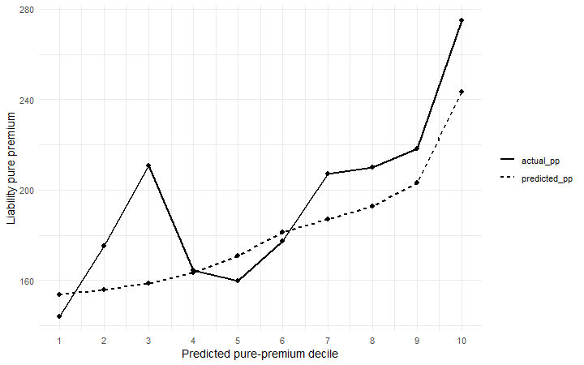

# Auto Insurance Pricing & Out-of-Time Validation

An actuarial loss-cost modeling project using automobile insurance policy-year data from 2022–2024. The goal is to predict liability pure premium using a frequency–severity framework and evaluate how well the model generalizes to a completely untouched future year.

## Project Overview

Liability loss cost is modeled as:

$$
\widehat{\text{Pure Premium}}
=
\widehat{\text{Claim Frequency}}
\times
\widehat{P(\text{positive loss}\mid\text{claim})}
\times
\widehat{\text{Positive Severity}}
$$

The project uses a strict temporal validation design:

- **2022:** model training
- **2023:** model selection and validation
- **2022–2023:** final model refit
- **2024:** untouched out-of-time test

This avoids randomly mixing future observations into model development and provides a more realistic test of prospective pricing performance.

## Models

### Claim Frequency

Liability claim counts are modeled with a **Negative Binomial GLM** using a log link and liability exposure as an offset.

Final predictors:

- Driver age
- Vehicle age and vehicle age²
- Bonus score
- Circulation area
- Municipality type

A Poisson model was evaluated first, but the Pearson dispersion statistic was approximately **1.40**, indicating overdispersion. The Negative Binomial model reduced the dispersion statistic to approximately **1.11** and improved AIC from approximately **124,699 to 120,468**.

### Positive Claim Severity

Positive liability severity is modeled with a **Gamma GLM with a log link**.

The response is average incurred loss per claim within each policy-year:

$$
S_i = \frac{L_i}{C_i}
$$

and observations are weighted by liability claim count.

Final predictors:

- Driver age
- Vehicle age
- Bonus score
- Circulation area
- Municipality type

Because many liability claims had zero recorded incurred loss, zero-loss claims were handled separately rather than forced into the Gamma model. Across 2022–2023, approximately **72.1%** of liability claims were associated with positive incurred loss.

## Model Validation

Candidate model specifications were trained on 2022 and evaluated on 2023.

Frequency-model aggregate A/E was approximately **0.961** across the tested specifications. More flexible driver-age specifications provided essentially no out-of-time improvement, so the simpler linear driver-age form was retained.

Positive-severity A/E values for the tested specifications were approximately:

| Specification | 2023 A/E |
|---|---:|
| Linear driver age | 0.974 |
| Quadratic driver age | 0.979 |
| Quadratic driver + vehicle age | 0.981 |

The simpler linear-age severity specification was retained because the more flexible models did not materially improve decile-level calibration.

## 2024 Out-of-Time Results

After model selection, the final models were refit on all 2022–2023 data and evaluated once on 2024.

| Metric | 2024 Result |
|---|---:|
| Aggregate liability loss A/E | **1.072** |
| Frequency A/E | **1.001** |
| Historical positive-loss probability | **72.1%** |
| 2024 positive-loss probability | **72.5%** |
| Positive-severity A/E | **1.063** |

Actual 2024 liability losses were approximately **7.2% higher than predicted**.

The decomposition shows that the miss was driven primarily by **positive claim severity**. Claim frequency was almost perfectly calibrated, and the positive-loss probability remained very stable.

## Risk Segmentation

Policies were ranked by predicted liability pure premium and grouped into deciles.

Predicted pure premium increased from approximately **$154** in the lowest predicted-risk decile to **$243** in the highest. Actual pure premium increased from approximately **$144** to **$275** across those same endpoint groups.

This indicates that the model provided meaningful out-of-time risk differentiation in addition to reasonable aggregate calibration.

## Business Interpretation

For the 2024 evaluation population:

| Metric | Value |
|---|---:|
| Liability premium | **$30.60M** |
| Actual liability losses | **$24.41M** |
| Predicted liability losses | **$22.76M** |
| Liability exposure | **126,014** |
| Actual loss ratio | **79.76%** |
| Modeled expected loss ratio | **74.39%** |

Because the dataset does not provide the insurer's expense, profit, contingency, or target loss-ratio assumptions, the rate indication is presented as a sensitivity analysis rather than a recommendation.

| Hypothetical Target Loss Ratio | Required Premium | Indicated Rate Change |
|---:|---:|---:|
| 65% | $35.02M | **+14.44%** |
| 70% | $32.52M | **+6.27%** |
| 75% | $30.35M | **−0.82%** |

Under a hypothetical 70% target loss ratio, the model implies required premium of approximately **$32.52M**, compared with **$30.60M** of existing liability premium.

## Notable Data Issues

Several data features required explicit treatment:

- One frequency-modeling observation had a liability claim despite zero recorded liability exposure and was excluded because a log-exposure offset requires positive exposure.
- A substantial number of liability property claims had zero incurred loss.
- Approximately **3,411** 2023 policy-year observations had property incurred loss equal to **$1,012 per property claim**, a concentration not explained in the dataset documentation.
- Positive severity was strongly right-skewed, with an unweighted policy-year mean of approximately **$1,484**, median of approximately **$1,012**, 95th percentile of approximately **$4,129**, and maximum of approximately **$174,769**.

The unusual $1,012 observations were retained because there was no evidence that they were erroneous.

## Reproducing the Analysis

1. Download the motor insurance dataset.
2. Place the CSV in the repository's `data/` directory as `original_dataset.csv`.
3. Open the R project in RStudio.
4. Knit `analysis/auto_insurance_pricing_report.Rmd` to HTML.

The analysis uses R packages including `tidyverse` and `MASS`.

## Data Source

The project uses the open motor-insurance dataset accompanying:

**“A detailed dataset of motor insurance policies with coverage-specific financial information.”**

Mendeley Data DOI: **10.17632/sw4jmdb2sm.1**

Dataset: https://data.mendeley.com/datasets/sw4jmdb2sm/1

## Limitations

The data consist of policy-year aggregates rather than individual claims, so severity is modeled as average incurred loss per claim within each policy-year. Severity discrimination was weaker than frequency discrimination, the available rating variables are limited, and the rate-indication section uses hypothetical target loss ratios because insurer-specific expense and profit assumptions are unavailable.

A production ratemaking analysis would also require items such as loss development, trend, expenses, reinsurance, regulatory considerations, and underwriting judgment.

## Key Takeaway

The final model achieved an aggregate **2024 A/E of 1.072** on an untouched future-year test while meaningfully separating lower- and higher-risk policies. Most of the remaining prediction error came from severity rather than claim frequency, illustrating both the usefulness and limitations of traditional actuarial GLMs for insurance pricing.
